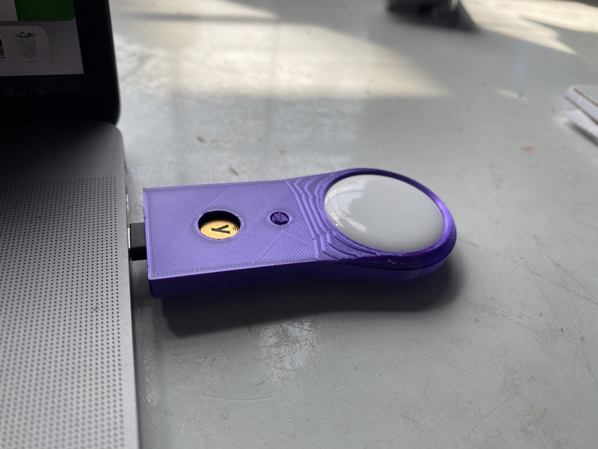
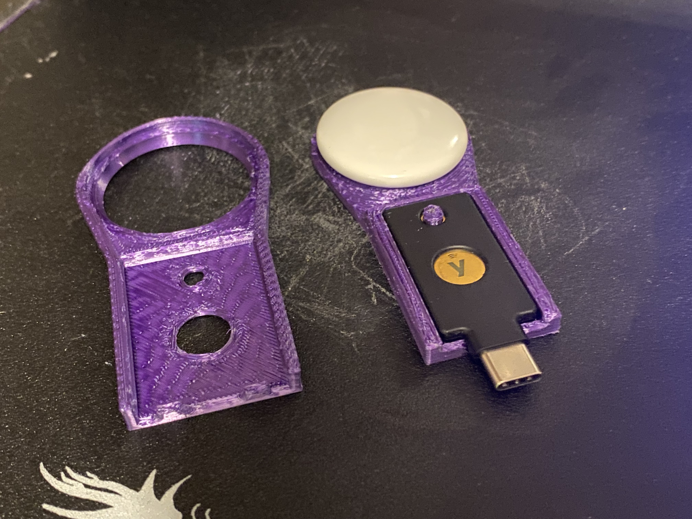
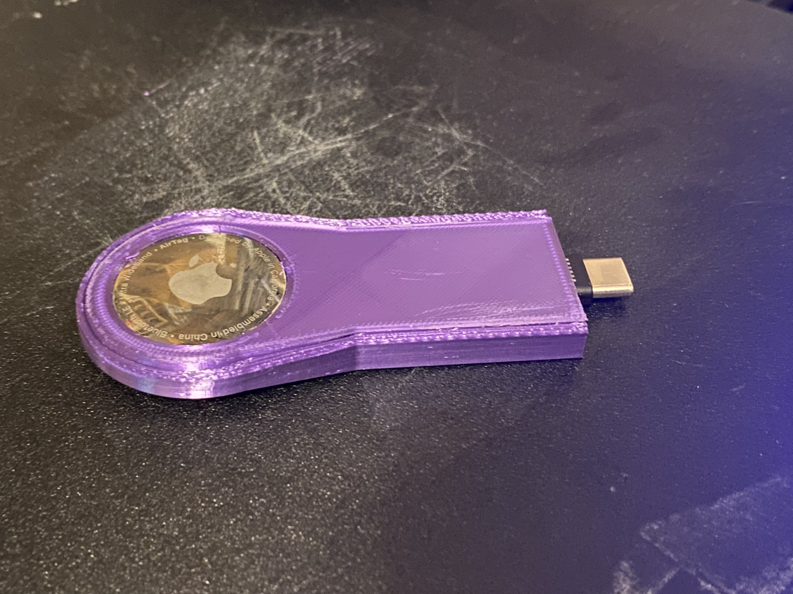
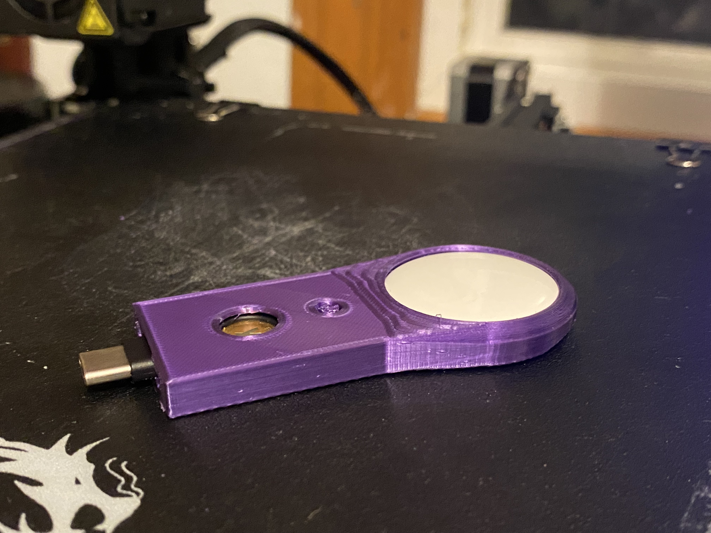
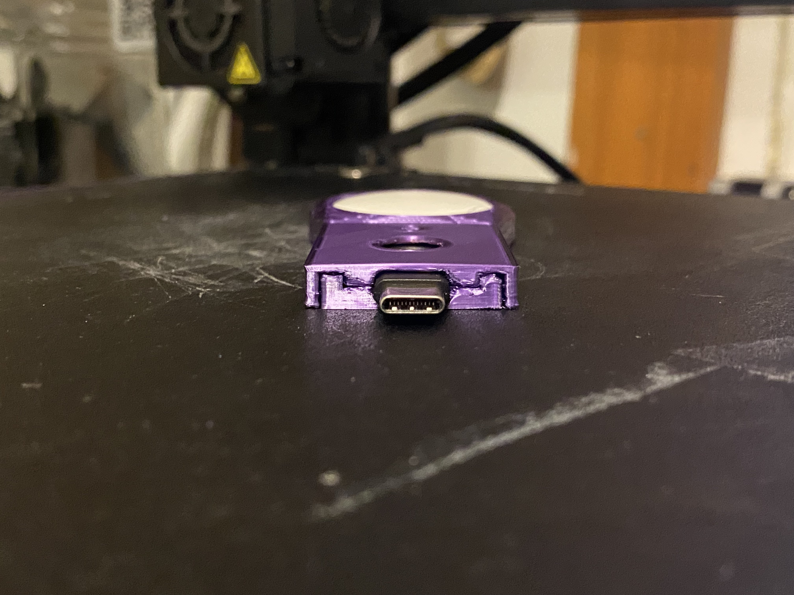
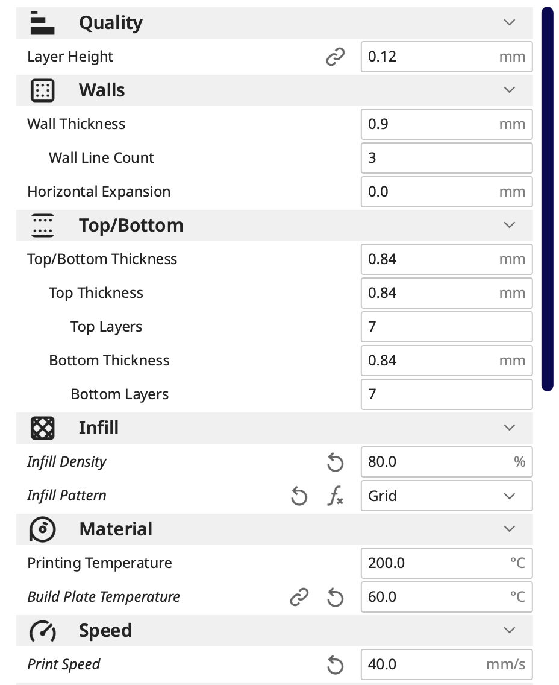
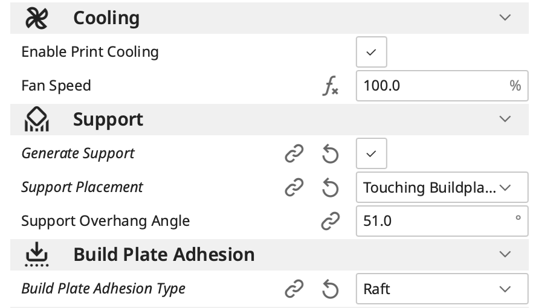

# Yubitrak
Tools to keep track of your YubiKeys.

At the moment the only supported models of YubiKeys are the 5C NFC. 

Don't ask for USB-A support, but you're welcome to contribute a model.

At the moment, the only tracker supported is the AirTag.

## 5C NFC + AirTag V1
A two-piece snap-fit case that holds both a YubiKey 5NFC and AirTag.

### Printing
Snap fits together along the edge and through the keyhole. To get a smooth top and bottom I've been printing upside down with supports as pictured below. I had some adhesion issues, so I've been using a raft as well. I'm sure it uses about as much filament as the actual model and takes a quarter of the time so if you can get away without a raft, it's worth a shot.

Here are my Cura settings:

